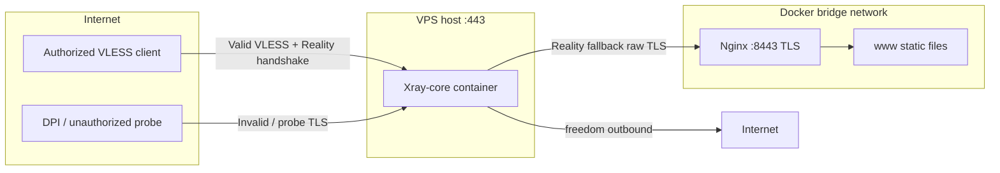

# VLESS+Reality Self-Stealth Proxy

A lightweight, DPI-resistant proxy stack for a 1 vCPU / 1 GB RAM VPS. Instead of spoofing a foreign domain, this **Self-Stealth** architecture uses **your own domain** pointing at your VPS. Unauthorized TLS probes are forwarded to an internal Nginx container that terminates TLS with a valid Let's Encrypt certificate and serves a realistic decoy website.

## Architecture



| Component | Role |
|-----------|------|
| **Xray** | Listens on host `:443`. Valid VLESS clients are proxied. Invalid probes are forwarded to Nginx via Reality. |
| **Nginx** | Internal `:8443` only. Terminates TLS with your LE cert and serves the decoy static site. |
| **certbot** | Issues and renews certificates on the host. `cert_deploy.py` copies them into `./certs/` and reloads Nginx. |

## Prerequisites

- A VPS with a public IPv4 address (1 vCPU / 1 GB RAM is sufficient)
- A domain with an **A record** pointing to the VPS IP
- Docker Engine + Docker Compose v2
- Python 3.9+
- [certbot](https://certbot.eff.org/) installed on the host
- Port **80** free during initial certificate issuance
- Port **443** free before starting the stack

Optional firewall rules:

```bash
sudo ufw allow 443/tcp
sudo ufw allow 80/tcp   # only needed for initial cert + renewals
```

## Quick start (automated)

### Option A — Ansible from your laptop (Ubuntu 22.04 VPS)

Fully automates OS packages, Docker, firewall, deploy, and bootstrap. See [`ansible/README.md`](ansible/README.md).

```bash
# On your laptop
cd ansible
ansible-galaxy collection install -r requirements.yml
cp inventory.example inventory
cp group_vars/all.example.yml group_vars/all.yml
# Edit inventory + group_vars/all.yml

ansible-playbook playbook.yml
```

### Option B — Manual bootstrap on the VPS

Clone this repository onto your VPS, then run the bootstrap script as root (certbot requires it):

```bash
cd poc-server
sudo python3 scripts/setup.py \
  --domain example.com \
  --email you@example.com \
  --install-cron \
  --install-renewal-hook
```

The script will:

1. Validate DNS (warns on mismatch)
2. Generate a VLESS UUID and Reality X25519 key pair via Docker
3. Patch `xray/config.json` and write `secrets/client.env`
4. Obtain a Let's Encrypt certificate (HTTP-01 on port 80)
5. Copy certs to `./certs/` and start `docker compose up -d`
6. Optionally install renewal automation
7. Print a ready-to-import VLESS URI

### Transport profiles (TCP vs xHTTP)

Two Reality transports share the same Self-Stealth Nginx fallback. Choose at install time:

| Profile | Command | When to use |
|---------|---------|-------------|
| **TCP + Vision** (default) | `--transport tcp` | Broad client support; direct connect |
| **xHTTP + stream-one** | `--transport xhttp` | TSPU-oriented; resists long-session TCP throttling |

```bash
# TSPU-oriented alternative (no Vision — incompatible with xHTTP)
sudo python3 scripts/setup.py \
  --domain example.com \
  --email you@example.com \
  --transport xhttp \
  --install-cron \
  --install-renewal-hook
```

Full rationale, TSPU notes, and client examples: [`docs/transports.md`](docs/transports.md).

Ansible: set `proxy_transport: xhttp` in `group_vars/all.yml`.

### Bridge + egress (multi-hop)

For users inside Russia, deploy two nodes: a **bridge** (accepts clients, split-routes RU traffic direct) and an **egress** abroad (final exit). See [`docs/multi-hop.md`](docs/multi-hop.md) for architecture and TSPU notes.

**1. Egress (abroad)** — produces `secrets/egress-peer.env` for the bridge:

```bash
sudo python3 scripts/setup.py \
  --role egress \
  --transport xhttp \
  --domain egress.example.com \
  --email you@example.com \
  --install-cron \
  --install-renewal-hook
```

**2. Bridge (RU / near-RU)** — clients import the URI printed here (bridge domain):

```bash
sudo python3 scripts/setup.py \
  --role bridge \
  --transport xhttp \
  --domain bridge.example.ru \
  --email you@example.ru \
  --egress-peer-file ./secrets/egress-peer.env \
  --install-cron \
  --install-renewal-hook
```

Re-run without regenerating keys: add `--keep-secrets` to either command.

Ansible: set `proxy_role: egress|bridge` and `proxy_egress_peer_file` for bridge hosts. See [`ansible/README.md`](ansible/README.md).

### Residential entry (home PC + port forward)

Run an **entry** node on a home PC behind a router (TCP 443 forwarded to LAN IP). Uses the same split routing as bridge but with inbound tag `phone-in` for mobile clients on LTE. **Native** install runs Xray + Nginx via systemd (no Docker).

See the full guide: [`docs/residential-entry.md`](docs/residential-entry.md).

```bash
sudo python3 scripts/setup.py \
  --role entry \
  --transport xhttp \
  --native \
  --egress-peer-file ./secrets/egress-peer.env \
  --domain entry.denko.app \
  --email you@example.com \
  --skip-compose \
  --install-renewal-hook

sudo bash scripts/install-native.sh
sudo systemctl enable --now denko-nginx denko-xray
```

| Role | `--role` | Transport | Profile | Deploy |
|------|----------|-----------|---------|--------|
| Single-node exit (default) | `egress` | `tcp`, `xhttp`, or `grpc` | `egress-*.json` | Docker |
| RU bridge hop | `bridge` | `tcp`, `xhttp`, or `grpc` | `bridge-*.json` | Docker |
| Home entry (port forward) | `entry` | `tcp`, `xhttp`, or `grpc` | `entry-*.json` | `--native` systemd |

**Provider-style mobile profile** (gRPC + tesla.com + qq, port 6437):

```bash
sudo python3 scripts/setup.py --provider --role egress --domain egress.example.com --email you@example.com
```

See [docs/grpc-provider.md](docs/grpc-provider.md).

**Protocol stack** (`--stack`):

| Stack | Description |
|-------|-------------|
| `xray` (default) | VLESS + Reality + Nginx decoy |
| `hysteria` | Hysteria2 QUIC/UDP only — good for mobile DPI; no Xray chain |
| `hybrid` | TCP/443 → Xray, UDP/443 → Hysteria2 (egress Docker only) |

See [docs/hysteria.md](docs/hysteria.md). Bridge/entry chain to Xray egress requires `--stack xray`. Entry TCP example:

```bash
sudo python3 scripts/setup.py --role entry --transport tcp --native \
  --egress-peer-file ./secrets/egress-peer.env \
  --domain yers.example.com --email you@example.com --skip-compose
```

## Manual setup

### 1. Generate secrets

Using Docker (no local Xray binary required):

```bash
# VLESS client UUID
docker run --rm ghcr.io/xtls/xray-core:latest uuid

# Reality X25519 key pair
docker run --rm ghcr.io/xtls/xray-core:latest x25519
```

The `x25519` command outputs:

- **PrivateKey** → paste into `xray/config.json` as `privateKey` (server-side only)
- **Password (PublicKey)** → client `pbk` parameter (older xray versions label this field `Password:`)
- **Hash32** → informational only; not used in client configuration

Generate an 8-character hex short ID (example):

```bash
python3 -c "import secrets; print(secrets.token_hex(4))"
```

### 2. Edit Xray config

Copy a profile and edit placeholders, or let `setup.py` do this automatically:

```bash
cp xray/profiles/egress-tcp.json xray/config.json    # or egress-xhttp / bridge-* / entry-*
```

| Placeholder | Value |
|-------------|-------|
| `<VLESS_UUID>` | Output of `xray uuid` |
| `<YOUR_DOMAIN>` | Your domain (e.g. `example.com`) |
| `<REALITY_PRIVATE_KEY>` | PrivateKey from `xray x25519` |
| `<SHORT_ID>` | 8 hex chars (e.g. `a1b2c3d4`) |
| `<XHTTP_PATH>` | xHTTP profile only (e.g. `/api/v1/a1b2c3d4`) |

**TCP profile:** include `"flow": "xtls-rprx-vision"` on the client. **xHTTP profile:** omit `flow`; set `"network": "xhttp"` and `"mode": "stream-one"`.

### 3. Obtain Let's Encrypt certificates

Ensure port 80 is free, then run certbot in standalone mode on the **host**:

```bash
sudo certbot certonly \
  --standalone \
  --preferred-challenges http \
  -d example.com \
  --agree-tos \
  -m you@example.com
```

Copy certificates into the project:

```bash
sudo cp /etc/letsencrypt/live/example.com/fullchain.pem ./certs/
sudo cp /etc/letsencrypt/live/example.com/privkey.pem ./certs/
sudo chmod 644 ./certs/fullchain.pem
sudo chmod 600 ./certs/privkey.pem
```

Or use the deploy script:

```bash
sudo PROXY_DOMAIN=example.com python3 scripts/cert_deploy.py
```

### 4. Start the stack

```bash
docker compose up -d
```

Verify containers are running:

```bash
docker compose ps
docker compose logs -f xray
```

## Certificate renewal

Certificates renew automatically if you installed the hooks during setup.

### Deploy hook (recommended)

Add to `/etc/letsencrypt/renewal/example.com.conf`:

```ini
deploy_hook = /path/to/poc-server/scripts/cert_deploy.py
```

Or run setup with `--install-renewal-hook`.

### Cron job

Installed by `setup.py --install-cron` as `/etc/cron.d/certbot-proxy-renew`:

```cron
0 3 * * * root certbot renew --quiet --deploy-hook "/path/to/poc-server/scripts/cert_deploy.py"
```

### What `cert_deploy.py` does

1. Reads the domain from `PROXY_DOMAIN` or `secrets/client.env`
2. Copies `fullchain.pem` and `privkey.pem` from `/etc/letsencrypt/live/$DOMAIN/` to `./certs/`
3. Reloads Nginx — Docker container by default; native host nginx when `PROXY_NATIVE=1`, `NATIVE=1` in secrets, or `--native` flag

For residential entry (native):

```bash
sudo PROXY_DOMAIN=entry.denko.app python3 scripts/cert_deploy.py --native
```

Test renewal (dry run):

```bash
sudo certbot renew --dry-run
```

## Client configuration

After setup, your connection parameters are stored in `secrets/client.env`:

```env
TRANSPORT=tcp
DOMAIN=example.com
VLESS_UUID=xxxxxxxx-xxxx-xxxx-xxxx-xxxxxxxxxxxx
REALITY_PUBLIC_KEY=...
SHORT_ID=a1b2c3d4
# xHTTP transport also includes:
# XHTTP_PATH=/api/v1/a1b2c3d4
# XHTTP_MODE=stream-one
```

### VLESS URI templates

**TCP + Vision:**

```
vless://<UUID>@<DOMAIN>:443?encryption=none&flow=xtls-rprx-vision&security=reality&sni=<DOMAIN>&fp=chrome&pbk=<PUBLIC_KEY>&sid=<SHORT_ID>&type=tcp
```

**xHTTP + stream-one (no `flow`):**

```
vless://<UUID>@<DOMAIN>:443?encryption=none&security=reality&sni=<DOMAIN>&fp=chrome&pbk=<PUBLIC_KEY>&sid=<SHORT_ID>&type=xhttp&path=%2Fapi%2Fv1%2F<hex>&mode=stream-one
```

See [`docs/transports.md`](docs/transports.md) for TSPU-oriented tuning notes.

### Parameter reference

| Parameter | Value | Notes |
|-----------|-------|-------|
| Address | `<DOMAIN>` | Your domain |
| Port | `443` | Host port mapped to Xray |
| UUID | `<VLESS_UUID>` | Client identity |
| Flow | `xtls-rprx-vision` | TCP only; **omit for xHTTP** |
| Security | `reality` | Reality protocol |
| SNI | `<DOMAIN>` | Must match `serverNames` in server config |
| Fingerprint (`fp`) | `chrome` | TLS client hello mimicry (also try `firefox`, `safari`) |
| Public key (`pbk`) | `<REALITY_PUBLIC_KEY>` | From `xray x25519` **Password (PublicKey)** field |
| Short ID (`sid`) | `<SHORT_ID>` | 8 hex characters |
| Type | `tcp` or `xhttp` | Transport |
| Path | `/api/v1/...` | xHTTP only; must match server |
| Mode | `stream-one` | xHTTP only; recommended with Reality |
| Encryption | `none` | VLESS default |

### v2rayN (Windows)

**Option A — Import URI**

1. Copy the VLESS URI printed by `setup.py`
2. Open v2rayN → **Servers** → **Import bulk URL from clipboard**

**Option B — Manual entry**

| Field | Value |
|-------|-------|
| Address | `example.com` |
| Port | `443` |
| UUID | your UUID |
| Flow | `xtls-rprx-vision` |
| Encryption | `none` |
| Transport | `tcp` |
| TLS | `reality` |
| SNI | `example.com` |
| Fingerprint | `chrome` |
| Public Key | your Reality public key |
| Short ID | your short ID |

Right-click the server → **Set as active server**, then enable system proxy.

**xHTTP transport:** use the URI from `--transport xhttp` setup, or set Transport to **XHTTP**, Path and Mode from `secrets/client.env`, and leave **Flow** empty. Requires a recent Xray core (v24.11.30+).

### Nekoray (Windows / Linux / macOS)

1. **Program → Preferences → Core** — ensure Xray core is selected
2. **Server → New profile → VLESS**
3. Fill in:

| Field | Value |
|-------|-------|
| Address | `example.com` |
| Port | `443` |
| UUID | your UUID |
| Flow | `xtls-rprx-vision` |
| Security | `Reality` |
| SNI | `example.com` |
| Fingerprint | `chrome` |
| Public Key | your Reality public key |
| Short ID | your short ID |

4. Save and start the profile

**Import URI:** Server → Add profile from clipboard (paste the VLESS URI).

**xHTTP transport:** Transport = XHTTP; Path / Mode from `secrets/client.env`; no Flow. Use Xray core ≥ 24.11.30.

### sing-box

Minimal client `config.json` (local SOCKS inbound + VLESS Reality outbound):

```json
{
  "log": { "level": "info" },
  "inbounds": [
    {
      "type": "mixed",
      "listen": "127.0.0.1",
      "listen_port": 1080
    }
  ],
  "outbounds": [
    {
      "type": "vless",
      "server": "example.com",
      "server_port": 443,
      "uuid": "YOUR-UUID-HERE",
      "flow": "xtls-rprx-vision",
      "tls": {
        "enabled": true,
        "server_name": "example.com",
        "utls": {
          "enabled": true,
          "fingerprint": "chrome"
        },
        "reality": {
          "enabled": true,
          "public_key": "YOUR-PUBLIC-KEY-HERE",
          "short_id": "a1b2c3d4"
        }
      }
    }
  ]
}
```

**xHTTP outbound** (omit `flow`, add transport block):

```json
{
  "type": "vless",
  "server": "example.com",
  "server_port": 443,
  "uuid": "YOUR-UUID-HERE",
  "tls": {
    "enabled": true,
    "server_name": "example.com",
    "utls": { "enabled": true, "fingerprint": "chrome" },
    "reality": {
      "enabled": true,
      "public_key": "YOUR-PUBLIC-KEY-HERE",
      "short_id": "a1b2c3d4"
    }
  },
  "transport": {
    "type": "xhttp",
    "path": "/api/v1/abc12345",
    "mode": "stream-one"
  }
}
```

Run:

```bash
sing-box run -c config.json
```

Point applications at `127.0.0.1:1080` (HTTP + SOCKS).

## Verification

### Test the proxy client

Connect with your VLESS client and verify outbound traffic (e.g. visit https://ifconfig.me — should show your VPS IP).

### Test the decoy site (internal)

The decoy is served on Nginx `:8443` inside Docker, not directly on the host. To preview it:

```bash
docker compose exec nginx wget -qO- --no-check-certificate https://127.0.0.1:8443/
```

Or temporarily stop Xray and publish Nginx on 443 for testing only:

```bash
docker compose stop xray
# add "443:8443" under nginx ports in docker-compose.yml, then:
docker compose up -d nginx
curl -I https://example.com
# revert changes and restart xray when done
```

Under normal operation, external HTTPS probes to `:443` hit Xray first; valid Reality clients connect, everything else sees the Nginx TLS handshake via Reality fallback.

## Troubleshooting

| Symptom | Likely cause | Fix |
|---------|--------------|-----|
| `bind: address already in use` on 443 | Another service using 443 | Stop conflicting service (`sudo ss -tlnp \| grep 443`) |
| certbot fails | Port 80 blocked or DNS wrong | Open port 80; verify A record |
| Xray exits on start | Invalid `config.json` | Check JSON syntax and placeholder values |
| Client cannot connect | Wrong `pbk`, `sid`, or `sni` | Match values in `secrets/client.env` |
| xHTTP fails, TCP works | Wrong `path` / `mode`, or Flow set on client | Remove `flow`; match `XHTTP_PATH` exactly |
| Nginx TLS errors | Missing certs in `./certs/` | Run `cert_deploy.py` |
| Renewal succeeds but site breaks | Certs not copied | Ensure deploy hook path is correct and executable |

View logs:

```bash
docker compose logs xray
docker compose logs nginx
```

## Security notes

- Never commit `secrets/` or `certs/*.pem` to version control (already in `.gitignore`)
- The Reality **private key** and VLESS **UUID** are secrets — treat `xray/config.json` as sensitive after setup
- Rotate the UUID and regenerate X25519 keys if you suspect compromise
- Keep Docker images updated: `docker compose pull && docker compose up -d`

## Repository layout

```
poc-server/
├── ansible/              # Ubuntu 22.04 Ansible playbook
├── docs/
│   ├── transports.md     # TCP vs xHTTP, TSPU notes
│   ├── multi-hop.md      # Bridge + egress topology
│   └── residential-entry.md  # Home PC port forward + native systemd
├── docker-compose.yml
├── xray/
│   ├── config.json       # Active config (written by setup.py)
│   └── profiles/
│       ├── egress-tcp.json
│       ├── egress-xhttp.json
│       ├── bridge-tcp.json
│       ├── bridge-xhttp.json
│       ├── entry-tcp.json
│       ├── entry-xhttp.json
│       ├── egress-grpc.json
│       ├── bridge-grpc.json
│       └── entry-grpc.json
├── nginx/nginx.conf
├── www/                  # Decoy static site
├── certs/                # TLS certs (populated by certbot)
├── scripts/
│   ├── setup.py          # Automated bootstrap
│   ├── cert_deploy.py    # Post-renewal cert copy + nginx reload
│   ├── install-native.sh # Install systemd units for --native entry
│   └── systemd/          # denko-xray / denko-nginx unit templates
└── secrets/
    ├── client.env        # Generated client parameters (gitignored)
    └── egress-peer.env   # Egress peer info for bridge (gitignored)
```

## License

Use at your own risk. Ensure compliance with local laws and your VPS provider's terms of service.
