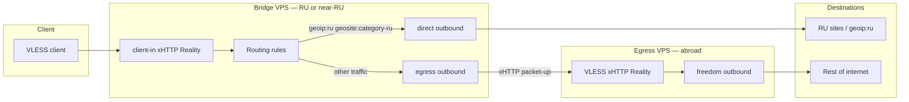

# Multi-hop: bridge + egress

This repo supports a two-node topology for users inside Russia: a **bridge** VPS (domestic or low-latency) accepts client connections and forwards non-Russian traffic to an **egress** VPS abroad. Russian destinations are routed **direct** from the bridge (split routing).

## Architecture



| Node | Role | Profile | Client connects? |
|------|------|---------|------------------|
| **Egress** | Final exit to the internet | `egress-xhttp.json` or `egress-tcp.json` | Yes (single-hop) or no (bridge-only) |
| **Bridge** | Split routing + relay | `bridge-xhttp.json` | Yes — use **bridge domain** in client URI |

Both nodes use the same Self-Stealth stack: Reality fallback to internal Nginx with Let's Encrypt on each domain.

## Setup order

Always configure **egress first**, then **bridge**.

### 1. Egress (abroad VPS)

Use xHTTP for the bridge chain (required for multi-hop in this repo):

```bash
cd poc-server
sudo python3 scripts/setup.py \
  --role egress \
  --transport xhttp \
  --domain egress.example.com \
  --email you@example.com \
  --install-cron \
  --install-renewal-hook
```

This writes:

- `secrets/client.env` — direct client URI params (if you connect to egress directly)
- `secrets/egress-peer.env` — copy to the bridge machine

Copy `secrets/egress-peer.env` securely to your bridge VPS (scp, ansible vault, etc.).

### 2. Bridge (RU or near-RU VPS)

```bash
cd poc-server
sudo python3 scripts/setup.py \
  --role bridge \
  --transport xhttp \
  --domain bridge.example.ru \
  --email you@example.ru \
  --egress-peer-file ./secrets/egress-peer.env \
  --install-cron \
  --install-renewal-hook
```

Or pass egress params explicitly:

```bash
sudo python3 scripts/setup.py \
  --role bridge \
  --transport xhttp \
  --domain bridge.example.ru \
  --email you@example.ru \
  --egress-domain egress.example.com \
  --egress-uuid ... \
  --egress-public-key ... \
  --egress-short-id ... \
  --egress-xhttp-path /api/v1/... \
  --egress-port 443 \
  --egress-chain-mode packet-up
```

**Import the VLESS URI printed by bridge setup** — it uses the bridge domain, not egress.

### 3. Reconfigure without rotating keys

```bash
sudo python3 scripts/setup.py --keep-secrets ...   # same flags as initial setup
```

Reuses UUID, Reality keys, short ID, and xHTTP path from `secrets/client.env` and the private key from `xray/config.json`.

## Bridge routing rules

The `bridge-xhttp.json` profile routes:

| Match | Outbound | Purpose |
|-------|----------|---------|
| `geoip:private` | `direct` | LAN / RFC1918 |
| `geosite:category-ru` | `direct` | Russian domains |
| `geoip:ru` | `direct` | Russian IP ranges |
| `client-in` tcp,udp | `egress` | Everything else → abroad |

Ensure Xray geo data is available in the container (default in official images).

## TSPU notes

Russian TSPU (technical means of countering threats) often targets **long-lived raw TCP** sessions and plain VLESS fingerprints. This topology addresses that in layers:

### Egress (client-facing when single-hop)

- **xHTTP + stream-one** on direct client → egress: one TLS connection, HTTP-style framing, Reality Self-Stealth fallback.
- **TCP + Vision** remains available (`--role egress --transport tcp`) for clients that do not support xHTTP.

### Bridge → egress hop

- Use **`packet-up`** on the bridge outbound (`EGRESS_CHAIN_MODE=packet-up` in `egress-peer.env`).
- `stream-one` is for direct Reality clients; relay hops through middleboxes benefit from `packet-up` semantics.
- Do not reuse the client `stream-one` mode on the bridge→egress leg unless you know your path does not need relay mode.

### Operational heuristics

- **Separate domains** for bridge and egress; each needs its own A record and LE cert.
- **Bridge in RU** (or low latency to users) keeps the first hop short; egress IP reputation matters less when clients only see the bridge.
- Avoid rapid parallel TLS probes to the same SNI from one NAT — can trigger blocks.
- Use `fp=chrome` (default in generated URIs).
- If sessions “freeze” after ~15–20 KB on TCP Vision, switch client to bridge + xHTTP or egress xHTTP — see [docs/transports.md](transports.md).

## Ansible

Set role and egress peer in `group_vars/all.yml`:

```yaml
proxy_role: bridge
proxy_transport: xhttp
proxy_egress_peer_file: /path/on/laptop/egress-peer.env
```

See [`ansible/README.md`](../ansible/README.md) for full variable reference.

## Files reference

| File | Produced by | Used by |
|------|-------------|---------|
| `secrets/client.env` | both roles | Client params; `--keep-secrets` |
| `secrets/egress-peer.env` | egress (xhttp) | Bridge `--egress-peer-file` |
| `xray/profiles/egress-*.json` | — | Egress templates |
| `xray/profiles/bridge-xhttp.json` | — | Bridge template |

## Further reading

- [docs/transports.md](transports.md) — TCP vs xHTTP, TSPU comparison
- [README.md](../README.md) — bootstrap and client import
- [Xray issue #6293](https://github.com/XTLS/Xray-core/issues/6293) — community TSPU reports
