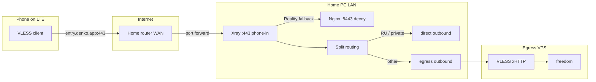

# Residential entry: home PC with router port forwarding

Run an **entry** node on a home PC behind a residential router. Clients connect to your domain from mobile LTE (or any external network); the router forwards TCP **443** to this machine. Traffic is split-routed like a bridge: Russian destinations go direct from home, everything else exits via your abroad **egress** VPS.

This guide uses **native** install (Xray + Nginx on the host via systemd, no Docker).

## Architecture



| Component | Role |
|-----------|------|
| **Router** | Forwards WAN `:443` → PC LAN IP (e.g. `192.168.1.50`) |
| **Xray** | Listens on `:443`, inbound tag `phone-in`, chains to egress |
| **Nginx** | Host `:8443`, Reality fallback target, serves decoy site |
| **Egress** | Abroad VPS — configure first; provides `egress-peer.env` |

See also [multi-hop.md](multi-hop.md) for bridge/egress chain details.

## Prerequisites

- Home PC on Linux (Arch Linux steps below; adapt for other distros)
- Router admin access for **TCP 443** port forwarding
- A domain or subdomain (e.g. `entry.denko.app`)
- Egress VPS already set up with `--role egress --transport xhttp`
- `secrets/egress-peer.env` copied from egress machine

## 1. Router port forward

1. Find this PC's **LAN IP** (e.g. `192.168.1.50`):
   ```bash
   ip -4 addr show | grep inet
   ```
2. In router admin UI, add a rule:
   - **External port:** 443 (TCP)
   - **Internal IP:** your PC LAN IP
   - **Internal port:** 443
3. Reserve DHCP for this PC so the LAN IP stays fixed.

## 2. Verify public IP

From the home PC or router:

```bash
curl -4 ifconfig.me
```

Note this IP — your DNS A record must point here.

## 3. DNS

Create an **A record**:

| Name | Type | Value |
|------|------|-------|
| `entry` (or `@`) | A | `<router public IP from step 2>` |

Example: `entry.denko.app` → `203.0.113.42`

Verify propagation:

```bash
dig +short entry.denko.app
```

### Dynamic IP (DDNS)

If your ISP changes your public IP:

- Use your router's built-in DDNS (No-IP, DuckDNS, etc.), **or**
- Run a DDNS client on the PC and point the A record / CNAME accordingly

Re-run certbot renewal after IP changes if HTTP-01 validation fails.

## 4. Egress first

On your abroad VPS:

```bash
sudo python3 scripts/setup.py \
  --role egress \
  --transport xhttp \
  --domain egress.example.com \
  --email you@example.com \
  --install-cron \
  --install-renewal-hook
```

Copy `secrets/egress-peer.env` to the home PC (scp, USB, etc.).

## 5. Install packages (Arch Linux)

```bash
sudo pacman -S xray-bin nginx certbot
```

Optional: enable certbot timer:

```bash
sudo systemctl enable --now certbot-renew.timer
```

## 6. Bootstrap entry (native)

Clone the repo on the home PC. **Stop anything listening on 443 and 80** before certbot.

```bash
cd poc-server
sudo python3 scripts/setup.py \
  --role entry \
  --transport xhttp \
  --native \
  --egress-peer-file ./secrets/egress-peer.env \
  --domain entry.denko.app \
  --email you@example.com \
  --skip-compose \
  --install-renewal-hook
```

What this does:

1. Validates DNS (warns if domain does not match outbound IP — expected behind NAT)
2. Generates UUID / Reality keys (host `xray` if available, else Docker)
3. Writes `xray/config.json` from `entry-tcp.json` or `entry-xhttp.json` (inbound `phone-in`)
4. Patches Reality `dest` → `127.0.0.1:8443`
5. Writes `nginx/nginx.native.conf` with Let's Encrypt paths
6. Runs **certbot standalone** on port 80 (must run **before** Xray binds 443)
7. Skips Docker Compose
8. Prints VLESS URI and systemd install steps

### Certificate order

Let's Encrypt HTTP-01 needs port **80** free. Xray needs port **443** free when services start.

Recommended order:

1. Run `setup.py` (issues cert via standalone certbot)
2. Install and start **nginx** (`denko-nginx`) — binds 8443 only
3. Start **xray** (`denko-xray`) — binds 443

Do **not** start Xray before certbot completes.

## 7. Enable systemd services

After setup:

```bash
sudo bash scripts/install-native.sh
sudo systemctl enable --now denko-nginx
sudo systemctl enable --now denko-xray
```

Unit files (templates with `REPO_ROOT` placeholder):

- `scripts/systemd/nginx.service` → `/etc/systemd/system/denko-nginx.service`
- `scripts/systemd/xray.service` → `/etc/systemd/system/denko-xray.service`

Check status:

```bash
systemctl status denko-nginx denko-xray
journalctl -u denko-xray -f
```

## 8. Client on mobile LTE

1. Copy the VLESS URI printed by setup (uses **entry domain**, not egress)
2. On phone, **disable Wi‑Fi** — use LTE only for first test
3. Import URI into v2rayNG, Nekoray, or sing-box (xHTTP, no `flow`)
4. Connect and browse — non-RU sites exit via egress IP

## 9. Troubleshooting

### Port forward

On LTE (not home Wi‑Fi), open `https://entry.denko.app/` in a browser. You should see the **Dark Archive** decoy page (valid TLS). If connection times out:

- Port forward rule wrong or PC firewall blocking 443
- DNS still pointing at old IP
- ISP blocking inbound 443 (try alternate external port + router remap — advanced)

```bash
# On PC — is Xray listening?
sudo ss -tlnp | grep ':443'

# Is nginx on 8443?
sudo ss -tlnp | grep ':8443'
```

### DNS mismatch warning

Setup may warn that the domain resolves to your router WAN IP but the PC's outbound curl IP differs. That is **normal** for residential NAT — ensure the A record matches `curl ifconfig.me`, not the LAN IP.

### certbot fails

- Port 80 in use: stop other web servers
- DNS not propagated: wait and retry
- Router must forward port 80 temporarily for HTTP-01, or use DNS-01 (not covered here)

### Xray fails to start

**`permission denied` on `xray/config.json`**

Systemd runs as root by default, but `/home/you` is often mode `700`. The install script runs Xray as the repo owner (`User=rian`) instead.

**`failed to load GeoIP: private` / `geoip.dat` missing**

Arch `xray-bin` does not ship geodata. Re-run:

```bash
sudo bash scripts/install-native.sh   # downloads geoip.dat + geosite.dat to /usr/share/xray
```

```bash
xray run -test -config xray/config.json
journalctl -u denko-xray -n 50
```

### Nothing on port 443

Nginx decoy listens on **8443**, not 443. Xray should bind **443**:

```bash
sudo ss -tlnp | grep -E ':443|:8443'
```

You should see `:8443` (nginx) and `:443` (xray).

### Renewal

Deploy hook reloads native nginx when `NATIVE=1` in `secrets/client.env`:

```bash
sudo PROXY_DOMAIN=entry.denko.app python3 scripts/cert_deploy.py --native
sudo certbot renew --dry-run
```

## 10. Reconfigure without new keys

```bash
sudo python3 scripts/setup.py \
  --role entry \
  --transport xhttp \
  --native \
  --keep-secrets \
  --egress-peer-file ./secrets/egress-peer.env \
  --domain entry.denko.app \
  --email you@example.com \
  --skip-compose
sudo systemctl restart denko-nginx denko-xray
```

### Hysteria2 (mobile DPI)

If VLESS fails on LTE but works on Wi‑Fi, try Hysteria2 (QUIC/UDP). No chain to egress — traffic exits from home IP:

```bash
sudo python3 scripts/setup.py \
  --stack hysteria \
  --role entry \
  --native \
  --domain entry.denko.app \
  --email you@example.com \
  --skip-compose

sudo bash scripts/install-native.sh --hysteria
sudo systemctl enable --now denko-hysteria
```

Forward **UDP 443** on the router (in addition to TCP). See [hysteria.md](hysteria.md).

## Files reference

| File | Purpose |
|------|---------|
| `xray/profiles/entry-tcp.json` | Entry template, TCP + Vision client inbound |
| `xray/profiles/entry-xhttp.json` | Entry template, xHTTP client inbound |
| `nginx/nginx.native.conf` | Generated host nginx config |
| `scripts/systemd/*.service` | Systemd unit templates |
| `scripts/install-native.sh` | Installs units to `/etc/systemd/system/` |
| `secrets/egress-peer.env` | From egress VPS |
| `secrets/client.env` | Client URI parameters |

## Further reading

- [README.md](../README.md) — general bootstrap and clients
- [multi-hop.md](multi-hop.md) — bridge + egress topology
- [transports.md](transports.md) — xHTTP / TSPU notes
- [hysteria.md](hysteria.md) — Hysteria2 stack
